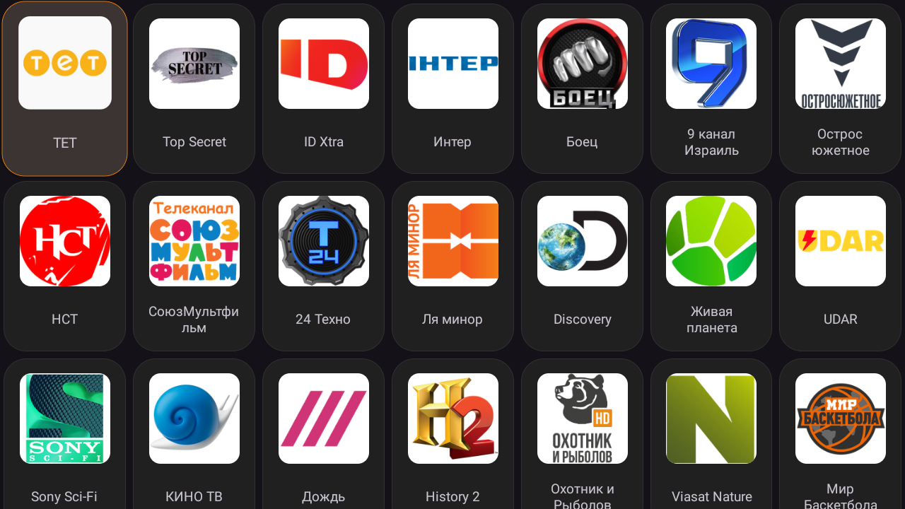
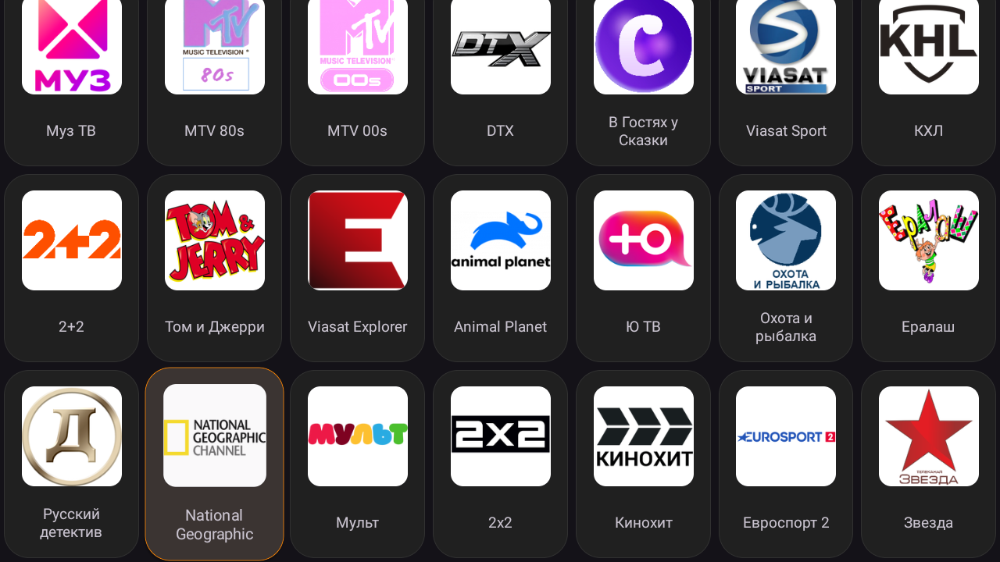
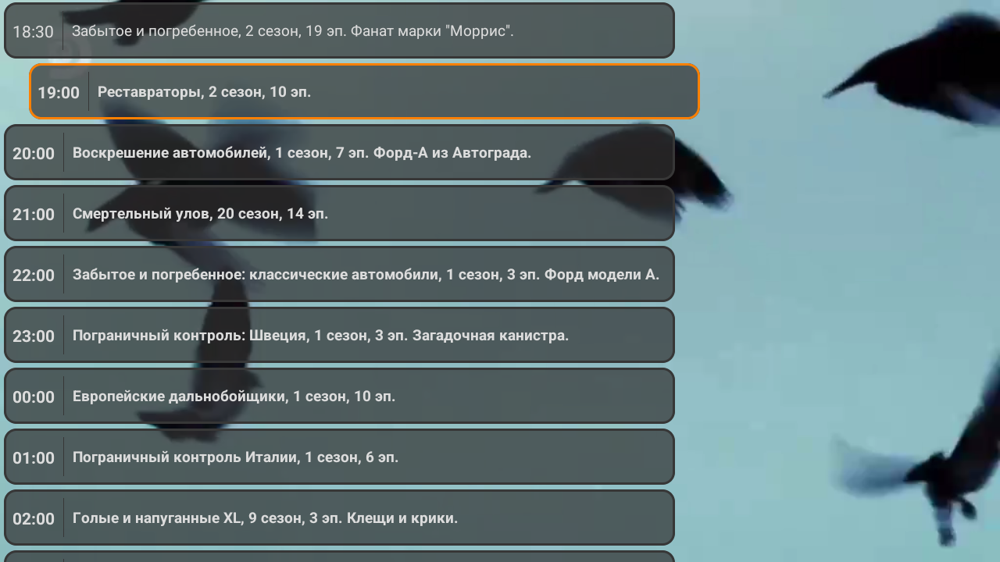
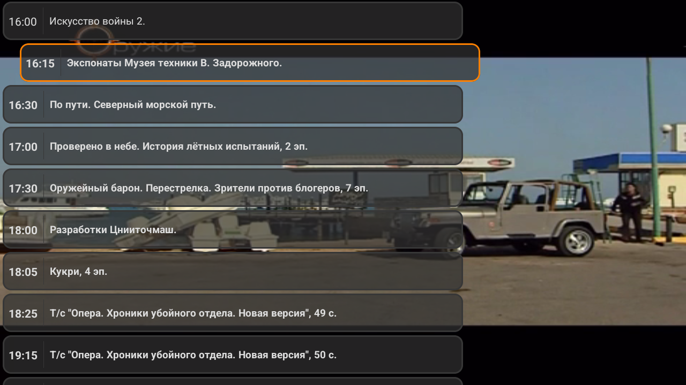

    

# ViksTV for Android and AndroidTV

Android application for the online Russian TV provider, with hundreds of channels!  
Android Приложение для онлайн-поставщика русских телеканалов с сотнями каналов!

Application for both your phone and your TV!  
Приложение как для вашего телефона, так и для вашего телевизора!

<h2>
    Browse all your favorite channels  
    Просматривайте все ваши любимые каналы.
</h2>

    
    

<b>
    And much more ...  
    И многое другое ...
</b>

<h2>
    Watch your high resolution channels with ease  
    Смотрите ваши каналы в высоком разрешении с легкостью.
</h2>

    
    

<h2>
    See what is playing right now  
    Посмотрите, что сейчас идет.
</h2>

  
  

<h2>
    Known Problems and Future Releases  
    Известные проблемы и будущие релизы
</h2>

 * Some channels doesn't work - that's a provider issue, not from the app.
 * Favorites is about to be added.

For bugs or requests for features, let me know!  
Если есть ошибки или запросы на функции, дайте мне знать!

<h2>
    Downlad / Скачайте
</h2>

https://github.com/Penkov-D/ViksTV/releases/download/AndroidTV/ViksTV.apk
